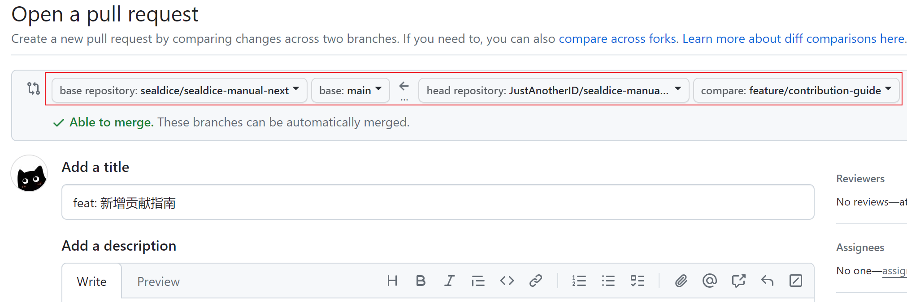

# 参与项目

无论是普通用户还是开发者，我们都非常欢迎你参与海豹的开发，一起努力让海豹变得更好。

所有源代码都托管在 [SealDice-CE GitHub](https://github.com/sealdice-ce) 下，每个模块都存放在对应的仓库中，可阅读 [sealdice-ce](https://github.com/sealdice-ce/sealdice-ce) 仓库的 README 获取更多信息。

## 如何参与项目？

### Bug 反馈、功能建议

所有的 Bug 和功能建议都可反馈在 [sealdice-ce](https://github.com/sealdice-ce/sealdice-ce) 仓库的 issue 中，按照模板填写可方便开发组快速定位问题。

::: tip 提示：无法访问 GitHub？

受限于各种原因，不是所有人都能顺利访问 GitHub，如有 Bug 可以加入官方群进行反馈。但如果有条件，我们还是建议在 GitHub 向开发组反馈问题。

:::

### 提交修改

欢迎各种类型的 pr 提交，可以帮助改进代码，增加功能，也可以是完善文档等等。向对应仓库发起 pr 即可。

## 贡献指南

海豹是一个开源项目，代码的开发、文档的编写等都涉及到开发者之间的协作。共同遵循一些原则有助于包括编写、维护、审核在内的每一个开发者。请在提 Pull Request 之前花几分钟来阅读以下内容。

### Pull Request

提交 Pull Request 时，需要遵循 **「一个模块的修改对应一个 PR」** 的原则。具体来说，如果是代码修改（如对 `core` 仓库的修改），一个 PR 仅包含一个完整功能的实现。如果是文档修改，则一个 PR 包含对某一个章节的修改。**不要将对多个不相关模块的修改，合并在一个巨石 PR 中一并提交。**

Pull Request 的标题是有意义的，应当用 **「简短但具体的一句话」** 概括本 PR 的修改内容。使用如 `feat: 完成了 xx 功能`，`fix: 修复了 xx 原因导致的 xx 问题` 等比较具体的描述，而不是 `改进功能`，`修复错误` 等非常宽泛的提示。这有助于后续其他开发者在审核及回看历史时大致了解这个 PR 的内容，也有助于在版本发布时总结本次迭代的影响范围。

如果你发现很难用一句具体的话进行概括，或者不得不用「和」等连词连接多个部分，你的 PR 有可能还能进一步拆分，请认真检查。

此外，影响很大的变更最好不要直接提交，最好先以 issue 等形式等先进行相关讨论，这样可以避免出现重复修改的情况。

在提交 Pull Request 之前，请确认以下步骤都已完成：

1. 基于 **最新主干代码** 做修改（通常是 `master` 分支）。
2. 代码的修改确认是完整可运行的，且在本地已自测可用。如果不是完整修改，请以 Draft PR 的方式提交来分享进度。
3. 能够通过相应仓库的测试和 Lint 检查。通常各个仓库都会有工作流进行自动检测，但请在本地提前进行检查。
4. 提交信息清晰规范，便于追踪改动内容。应当遵循 [惯例格式](https://www.conventionalcommits.org/zh-hans/v1.0.0/)，便于后续维护和版本管理。
5. 代码风格保持一致，遵循各仓库已有的代码规范。

### 手册

海豹手册是向用户提供的官方使用指南，我们希望手册能够尽量解决海豹的使用问题，但同时也希望手册是便于维护的，不要带来不必要的维护压力。目前来说，我们希望：

- **手册属于海豹**：海豹手册是介绍海豹使用的相关指南，主要目标在于介绍诸如指令使用、扩展系统等海豹自己功能的使用和帮助。
  - 外部内容仅作引导：以 QQ 对接为例，仅介绍大体流程和指向相应对接方式自己的手册。QQ 平台的特殊现状导致变动频繁，应当指引用户查看对接方自己的手册以获得最新提示，不要在海豹手册中介绍过时内容。
  - 不要介绍敏感内容：诸如「选择哪一家服务器」（涉及金钱），「某对接方式的签名问题」（涉及侵权），「如何访问 GitHub」等不适当的话题，不应在手册中介绍。
- **手册是准确的**：手册介绍内容时务必准确，新版本的变动都应具体到版本号，表述不要模棱两可。编者本身都不清楚的内容，宁可跳过不写也不要误导用户。
  - 一些历史遗漏内容也没有很好的做到这一点，但由于维护压力目前只能以在章节前进行警告的方式保留，引以为戒。
- **手册是规范的**：手册措辞使用规范的书面语，不要太过口语化。排版遵循 [中文文案排版指北](https://github.com/sparanoid/chinese-copywriting-guidelines) 的规范。
  - 合理划分章节与子章节，各小节之间内容层次分明。
  - 适当使用截图、图表等辅助说明复杂操作。对于图片，需要特别确认在 PC 端和移动端，日间和夜间模式下均可良好展示。
  - 保持术语一致性，同一概念在全手册中应使用相同的表达方式。
  - 重要提示和注意事项应使用相应记号突出显示。但不要滥用记号导致出现提示比正文还多的情况。

## 贡献流程

::: info 贡献流程

下面将以提交对手册的改进为示例，为还不清楚怎么在 GitHub 上提 Pull Request 的准贡献者做个示范。

:::

### 整体流程

1. 首先 fork 对应想要修改的仓库，后续所有操作均在 fork 之后的仓库上执行；
2. 从主分支（通常是 `main` 或 `master`）切出一个新分支作为工作分支；
3. 在新工作分支上提交修改。如果是对代码仓库进行修改，务必在本地测试通过；
4. 将修改后的内容提交到远程后，在 GitHub 发起 Pull Request 请求，描述修改内容并确认自动测试流程通过；
5. 等待开发组 review 后合并你的代码。

### 对目标仓库进行 fork

首先 fork 对应想要修改的仓库，此处以手册仓库 [sealdice-manual-next](https://github.com/sealdice/sealdice-manual-next) 为例：

点击 `Create a new fork` 按钮，如果此处已经有 fork 过仓库，可以直接进行后续步骤无需再次 fork。

点击按钮后进入如下页面：

可不做任何修改，直接点击 `Create fork` 按钮，等待 fork 进度条完成，此时你应当自动跳转到了 fork 出的新仓库。

### 切出工作分支

::: tip 提示：假如你熟悉 Git 操作

如果你熟悉 Git 操作，可以自行 clone 仓库到本地后进行修改。

:::

::: warning 注意：不要修改主分支

如果 clone 到本地操作，建议不要在主分支操作，而是新切分支进行编辑。

原因见 [保持和上游同步](#保持-fork-仓库与上游同步-可选)。

:::

切换到新仓库的分支页面，创建分支：

填写新分支名，建议为形如 `feature/xxx` 的有意义的英文。确认前请务必保证是从主分支切出的。

创建完毕后点击分支名切换到对应分支页面：

点击你想要修改的文件，进行在线编辑：

修改完成后点击右上角提交变更，填写变更内容信息：

### 发起 Pull Request 请求

你的修改完成后，在你 fork 的新仓库向主仓库发起 Pull Request：

提交时间很近的时候，GitHub 会提示快捷发起 PR 的操作按钮：

进入 PR 编辑页填写信息，请确认是从你的仓库的新分支，提向主仓库的主分支的：

`主仓库 主分支 <- fork仓库 功能分支`

填写完成后，等待开发组进行 review，有时会给你提出一些修改建议。在你的 PR review 通过并合并后，功能分支就可以被删除了。

### 保持 fork 仓库与上游同步（可选）

如果之后还要提交新的 PR，建议先同步上游的主分支，再从同步后的主分支再新切分支进行操作。

如果你曾经修改了主分支，此处很可能会出现和上游分支有冲突的问题，需要你先手动解决冲突。

点击 `Sync fork` 进行同步。

